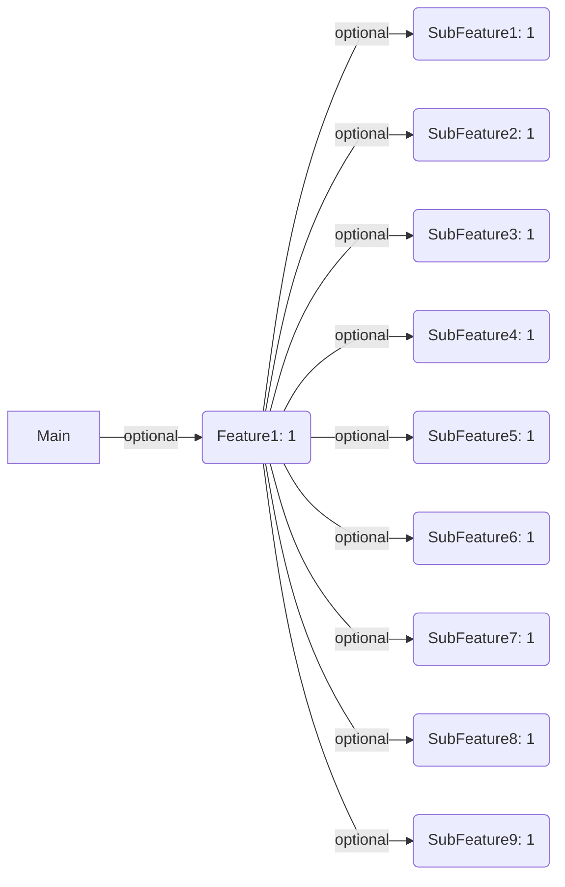

# TCADiagram

Create [mermaid](https://docs.github.com/en/get-started/writing-on-github/working-with-advanced-formatting/creating-diagrams) md file from [swift-composable-architecture](https://github.com/pointfreeco/swift-composable-architecture) to show the full diagram of your feature relationships.

Refer to example here: https://github.com/tisohjung/ifletstore/blob/main/diagram.md



## Build & Test the Library

build this project or download the tca-diagram file from the latest release
Build:
```sh
make build
make test
```
Run:
```
./tca-diagram -r . tca-diagram.md
```


## Usage

```sh
USAGE: tca-diagram [--root-directory <root-directory>] <output>

ARGUMENTS:
  <output>                Markdown file

OPTIONS:
  -r, --root-directory <root-directory>
                          Root directory of swift files (default: .)
  --version               Show the version.
  -h, --help              Show help information.
```

## Release

```sh
VERSION=<version> make release
```

## Todos
- [x] ~~Scopes~~
- [x] ~~optionals~~
- [x] ~~ifLet~~
- [x] ~~functions inside `extension Reducer {...}` isn't parsed.~~
- [x] ~~case paths like `.ifLet(\.$destination, action: \.destination) {`~~
